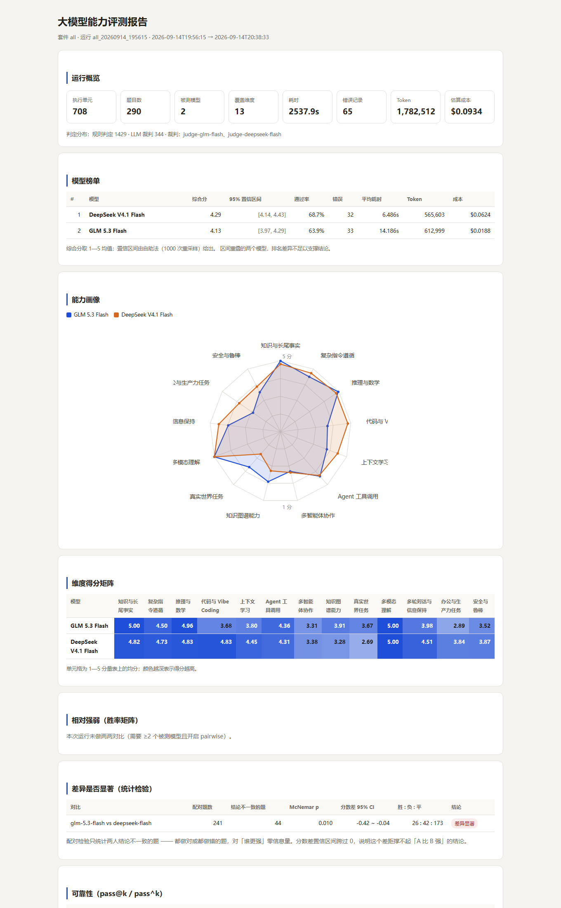
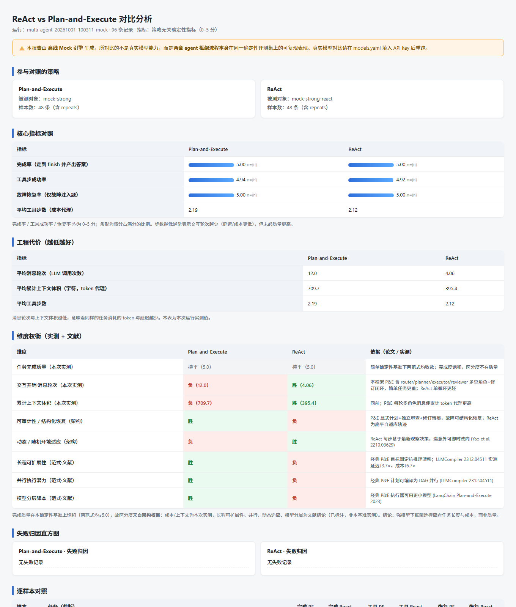

<div align="center">

# llmeval

**可插拔的大模型能力评测框架：评测集 × 三层判定 × 偏差控制 × 裁判校准 × 归因闭环**

*A pluggable LLM evaluation framework* — [English](README_EN.md) | 简体中文

[](https://github.com/asdfaj23/llmeval/actions/workflows/ci.yml)
[](LICENSE)
[](https://www.python.org/)
[](tests/)
[](requirements.txt)

</div>

---

## 为什么做这个

大多数"大模型评测"的做法是：找几个公开榜单跑一遍，排名，结束。这条路有三个绕不开的问题——**公开基准饱和快**（厂商针对性优化，区分度几个月内掉光）、**与真实使用脱节**（榜单高分不代表能处理用户手里 messy 的真实请求）、**不可解释**（只给总分，不告诉你差在哪、下一步补什么）。

llmeval 走另一条路：**先梳理真实用例，再抽象成可评测的类别**，把评测做成一件可复现、可信、能指向下一步动作的事。设计对齐字节 Seed 评测体系（Seed1.8 三原则 / Seed2.0 四维框架 / Seed2.1 产品驱动评测），并引入 NeurIPS 2025 构念效度自检——那项研究发现 445 篇 benchmark 研究中只有 16% 在比较模型时用了统计检验，本框架把配对检验做成了标配。

## 亮点速览

| | |
|---|---|
| 🧱 **三层判定架构** | 确定性规则（全量执行、零成本、零偏差）→ LLM 裁判（G-Eval / pairwise / 评审团）→ 人工标注（只用于校准）。核心取舍：**能用规则判的，绝不交给裁判**——约 81% 的题目由程序硬判定 |
| 📊 **统计显著性标配** | 配对 McNemar 检验 + bootstrap 95% 置信区间。分差落在噪声范围内时，报告直接写「不足以判断谁更强」，不挑赢家 |
| 🔁 **可靠性：pass^k** | 同题跑 k 次全过才算过（τ-bench 范式）。pass@k 与 pass^k 差距越大，模型越不稳定——上线决策该看的数 |
| ⚖️ **裁判校准** | Cohen's κ（有序分用二次加权）+ 评审团内部一致性 + 中位数聚合抗离群。κ < 0.6 时报告自动挂警示：分数只作参考，不作为发布门禁 |
| 🎭 **偏差控制与披露** | pairwise 强制双向换位（位置偏差）、冗长获胜率度量（冗长偏差）、裁判与被测同族自动告警（自偏好）。偏差不可消除，只能度量 + 缓解 + **如实披露** |
| 🔄 **数据飞轮闭环** | 失败归因 → 数据策略建议 → 候选题生成（带 `needs_review` 门禁），badcase 不是终点，是下一轮数据生产的起点 |
| 🥊 **Agent 范式对比** | ReAct vs Plan-and-Execute：同一模型端点双 strategy 实例化，隔离「框架差异」而非「模型差异」，沿策略无关指标评估 |
| 🪶 **极简可复现** | 运行时唯一依赖 PyYAML；HTTP 走标准库 urllib；统计全靠标准库实现；纯 CPU 可跑；内置 mock 离线跑通全流程 |

## 快速开始

**环境要求**：Python 3.10+，无 GPU，无 API key（离线演示不需要任何凭据）。

```bash
git clone https://github.com/asdfaj23/llmeval.git
cd llmeval
pip install PyYAML        # 唯一的运行时依赖

# 1. 看有哪些套件、评分表、能力维度、模型状态
python run.py list

# 2. 跑一次完整评测（默认 mock 模型，离线可跑）
python run.py run --suite all --pairwise

# 3. 出报告（纯本地计算，不重新调模型）
python run.py report --run latest --open
```

跑完在 `outputs/runs/<run_id>/report.html` 得到一份**自包含的单文件 HTML 报告**，双击就能看。

> **关于 mock**：默认启用的两个模拟模型只用于验证流水线本身没坏，产生的是模拟数据，**不能用来判断任何真实模型的能力**（报告页首会挂红色警示条）。接上真实 API 就是真结果，见下节。

### 接入真实模型

改两个文件，代码一行不动：

```bash
cp .env.example .env        # 填上任意服务商的 API key
```

```yaml
# configs/models.yaml —— 把要测的模型 enabled 改成 true
suts:
  - id: deepseek-chat
    provider: deepseek
    model: deepseek-chat
    enabled: true             # ← 改这里
```

内置 provider：火山方舟 / DeepSeek / Moonshot / 通义 / 智谱 / OpenAI，全部走 OpenAI 兼容协议，换服务商只改 `base_url`。

## 报告一览



*真实评测报告（GLM vs DeepSeek，290 题 / 13 维度 / 708 条执行记录）：运行概览 → 模型榜单（含 95% 置信区间）→ 能力画像雷达图 → 维度得分矩阵 → 显著性检验，全部在一份自包含 HTML 里。*

## 它在测什么：13 个能力维度

每一个维度都标注了真实用例来源或公开基准对齐依据——**从真实用例反推维度，而不是把公开榜单抄一遍**：

| 维度 | 名称 | 对齐依据 |
|---|---|---|
| `knowledge` | 知识与长尾事实 | Seed2.0 模型卡点名的短板之一：长尾知识缺口 |
| `instruction` | 复杂指令遵循 | Seed2.0 模型卡点名的短板之一：复杂多步指令失败 |
| `reasoning` | 推理与数学 | Seed 评测三原则之「推进智能前沿」 |
| `coding` | 代码与 Vibe Coding | Seed2.0 四维框架之一：从一句话需求到可运行产物 |
| `long_context` | 上下文学习 | Seed2.0 四维框架之一：长文档中提取并推理 |
| `agent` | Agent 工具调用 | Seed1.8/2.1 核心方向，参照 τ-bench 与 GAIA 范式 |
| `multi_agent` | 多智能体协作 | Seed2.1「与 harness、工具、产品环境结合评估」，参照 MultiAgentBench |
| `knowledge_graph` | 知识图谱能力 | 三元组抽取与多跳推理（结构化知识场景） |
| `realworld` | 真实世界任务 | Seed2.0 四维框架之一：端到端任务完成 |
| `multiturn` | 多轮对话与信息保持 | 《LLMs Get Lost in Multi-Turn Conversation》 |
| `multimodal` | 多模态理解 | 跨模态数据服务场景（图表读数/计数/空间关系/图示理解） |
| `office` | 办公与生产力任务 | Seed2.1 众测任务中占比最高的一类 |
| `safety` | 安全与鲁棒 | 拒答边界、幻觉、提示注入 |

## 三层判定架构

```
Tier 1  确定性规则   全量执行 · 零成本 · 零偏差 · 完全可复现
        格式约束 / 字数 / 必含禁含 / JSON schema / 正则 / mcq / 数值容差 / 安全启发式

Tier 2  LLM 裁判     抽样执行 · 有成本 · 需要校准
        G-Eval 单点打分 · pairwise 双向换位 · 参考对齐
        多裁判评审团：独立打分 → 中位数聚合 → 度量裁判间一致性

Tier 3  人工标注     小样本 · 用来校准 Tier 2，不是用来打分
        Cohen's κ · 加权 κ · 一致率 · Spearman · MAE
```

**为什么分层**："字数是否超限"是确定性问题，用 LLM 去判它既贵又不稳，还引入完全不必要的偏差。同理，多智能体的失效模式（审查者从不否决、否决了没人改、某角色包办一切）都是可以在消息记录上直接数出来的事实——这些全用确定性判定，裁判只在最后一层兜底答案质量。

## 真实评测案例

框架已完成两款主流模型的 13 维度全量真实评测（708 条执行记录、0 调用错误、固定温度可复现），以及同一基准上的 Agent 范式对比：

**模型层对比（DeepSeek vs GLM）**：
- 综合 4.29 vs 4.13，配对 241 题 McNemar 检验 p=0.0104，**差异显著**
- 短板画像截然不同：代码维度差距最大（4.83 vs 3.68），知识图谱、办公任务互有胜负
- 成本反直觉：DeepSeek 综合成本约为 GLM 的 3.3 倍——能力结论必须连同成本一起读
- 可靠性：两者 pass^3 均为 0.34，不稳定题 7 vs 4——平均分相近，稳定性不同

**范式层对比（ReAct vs Plan-and-Execute，同一模型端点）**：
- 任务完成质量完全持平（均 5.0/5）——强模型下选框架看任务长度与成本，而非质量
- 交互开销差 3 倍：ReAct 约 4 轮调用 vs Plan-and-Execute 约 12 轮
- 定性差异：ReAct 更轻量、动态适应强；Plan-and-Execute 以开销换显式计划、可审计性与结构化故障恢复



*范式对比报告：核心指标对照（策略无关指标）、工程开销、维度级权衡（实测 + 文献依据）与失败归因。上图为离线 mock 数据生成的报告结构演示。*

> 这些数字只是快照，随评测集与被测版本变化。**比结论更重要的是结论的得出方式**：每条都有显著性检验、置信区间与逐条可展开的判定依据。

## 报告里有什么

| 区块 | 回答的问题 |
|---|---|
| 运行概览 | 跑了多少、花了多少、错了多少 |
| 模型榜单 | 谁更强，**差距是否显著**（自助法 95% 置信区间） |
| 能力画像 | 雷达图：优势与短板在哪 |
| 维度得分矩阵 | 模型 × 维度完整热力表 |
| 胜率矩阵 | 两两对比相对强弱（双向换位，位置敏感记平局） |
| 可靠性 | pass@k vs pass^k |
| 裁判可信度 | κ 值——裁判的分到底能不能信 |
| 评审团一致性 | 多裁判之间的加权 κ / 完全一致率 / 平均分歧 |
| 偏差度量 | 位置一致性、冗长偏好、自偏好风险，全部如实披露 |
| 短板归因与数据策略 | 失败类型分布 → 对应补什么数据 |
| 失败样本明细 | 逐条可展开的 badcase，含题面/回答/参考/判定依据 |

## 目录结构

```
llmeval/
├── run.py                     命令入口
├── requirements.txt           唯一依赖 PyYAML
├── .env.example               凭据模板
│
├── configs/
│   ├── models.yaml            模型注册表：被测 / 裁判 / 运行时参数
│   ├── suites/                评测套件：数据集 × 指标 × 模型矩阵
│   └── rubrics/               评分表（G-Eval 形态：criterion + steps + anchors）
│
├── datasets/                  评测集（JSONL，290+ 题，13 维度 × 易中难）
│   ├── schema.md              评测集编写规范（必读）
│   ├── general/               knowledge / instruction / reasoning / coding / ...
│   ├── agent/  multiagent/  multiturn/  multimodal/  office/  safety/
│   └── calibration/           人工标注样例（裁判校准用）
│
├── src/llmeval/
│   ├── schema.py              数据结构 + 能力维度表
│   ├── client.py              统一 LLM 客户端（urllib，缓存/重试/并发）
│   ├── mock.py                离线模拟引擎
│   ├── sut/                   被测系统：chat / agent / multi_agent / multi_turn
│   ├── metrics/               三层判定：deterministic / judge / agent / collab / kg
│   ├── bias.py                偏差度量（位置 / 冗长 / 自偏好）
│   ├── calibration.py         Tier3 校准（κ / 一致率 / 评审团一致性）
│   ├── stats.py               McNemar + bootstrap 显著性检验
│   ├── pipeline.py            流水线编排
│   ├── analysis.py            聚合、归因、数据策略
│   └── report.py              单文件 HTML 报告（内联 SVG 雷达图）
│
├── scripts/                   评测集构建 / 金标 κ / 人工盲评页 / badcase 飞轮
├── tests/                     pytest 离线单测（217 条，不调任何 API）
└── docs/                      评测体系 / 架构说明 / 命令手册 / Seed 方法对照
```

## 命令速查

```bash
python run.py list                                    # 套件 / 评分表 / 维度 / 模型状态
python run.py run --suite all --pairwise              # 全量评测，带两两对比
python run.py run --suite agent                       # 只跑 Agent（repeats=3，算 pass^k）
python run.py run --suite all --limit 20              # 先跑 20 题试水
python run.py report --run latest --open              # 出报告（纯本地，不花钱）
python run.py calibrate --run latest --gold <gold.jsonl>   # 人工标注校准裁判
python run.py failures --run latest --top 5           # 终端快速看失败样本
```

## 设计文档

| 文档 | 内容 |
|---|---|
| [docs/评测体系.md](docs/评测体系.md) | 每一处设计的依据：维度怎么来的、评分表怎么设计、指标口径、评估 SOP |
| [docs/架构说明.md](docs/架构说明.md) | 代码结构、数据流、怎么加维度/指标/被测对象 |
| [docs/命令手册.md](docs/命令手册.md) | 全部命令、六个典型场景、参数详解 |
| [docs/字节评测方法对照.md](docs/字节评测方法对照.md) | 每条设计对应的字节 Seed 方法与顶会论文出处，含构念效度自检 |
| [datasets/schema.md](datasets/schema.md) | 评测集编写规范 |

## 诚实的边界

写在功能列表前面，因为这些更重要：

1. **模拟数据不是结论。** mock 只验证流水线，不代表任何真实模型的能力。
2. **没有人工标注就算不出 κ。** 报告的「裁判可信度」会留空，不用别的指标顶替。
3. **290+ 题仍是种子集规模，不是生产题库。** 题目是人工构造的，不是从真实用户请求采样的——这是与工业界评测最主要差距，路线图正在补。
4. **分差要过统计检验才下结论。** 落在噪声范围内时，报告直接写「不足以判断谁更强」。
5. **代码判定尚未真实执行。** `coding` 维度目前靠裁判读代码打分，沙箱执行是路线图第一项。

## 路线图

- [ ] `coding` 维度接入子进程沙箱真实执行
- [ ] 全维度开启 repeats，pass^k 覆盖所有维度
- [ ] 引入真实用户请求采样，扩充题库
- [ ] 英文评测集与报告国际化

## 贡献

欢迎 Issue 与 PR！见 [CONTRIBUTING.md](CONTRIBUTING.md)——新维度、新指标、新 SUT 都有标准接入方式；最被欢迎的贡献是 coding 沙箱执行器。请遵守[行为准则](CODE_OF_CONDUCT.md)。

## 引用

如果这个项目对你的评测实践有帮助，欢迎引用：

```bibtex
@software{qiu2026llmeval,
  author  = {Qiu, Zice},
  title   = {llmeval: A Pluggable LLM Evaluation Framework with
             Three-Tier Judging, Bias Control and Judge Calibration},
  year    = {2026},
  url     = {https://github.com/asdfaj23/llmeval},
  license = {MIT}
}
```

## License

[MIT](LICENSE) © 2026 邱子策 (Zice Qiu)

## 主要参考

- Seed 1.8 / 2.0 / 2.1 Model Card（Bytedance Seed）—— 评测三原则、四维框架、产品驱动评测
- G-Eval（Liu et al., 2023, arXiv:2303.16634）—— 评分表范式
- MT-Bench / Chatbot Arena（Zheng et al., 2023）—— LLM-as-a-Judge 与位置偏差
- τ-bench（Sierra）—— pass^k 可靠性指标
- Length-Controlled AlpacaEval（Dubois et al., 2024）—— 冗长偏差控制
- PoLL（Verga et al., 2024）—— 裁判委员会优于单一裁判
- MultiAgentBench（Zhu et al., 2025）—— 多智能体评测
- Landis & Koch (1977) —— κ 判读区间
